# MongoDB-for-Android

### Steps to be  followed in the backend:

1. create an account on [MongoDb](http://mongodb.com) official website

2. Fill this: as per your choice..

3. Select a plan, for now, select free one (shared)
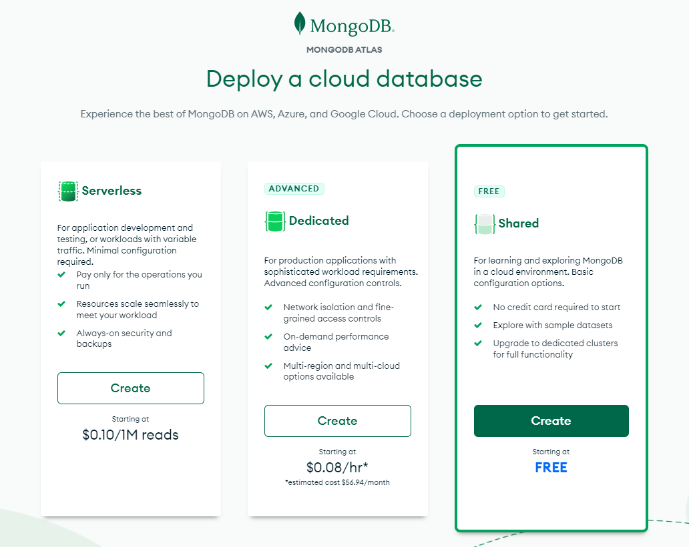

4. will see as follow, continue with default settings:
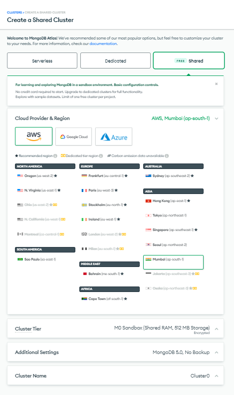

 
5. provide a new username and password to create an user. Also add current ip address, then finish and close
<table>
  <tr>
    <td>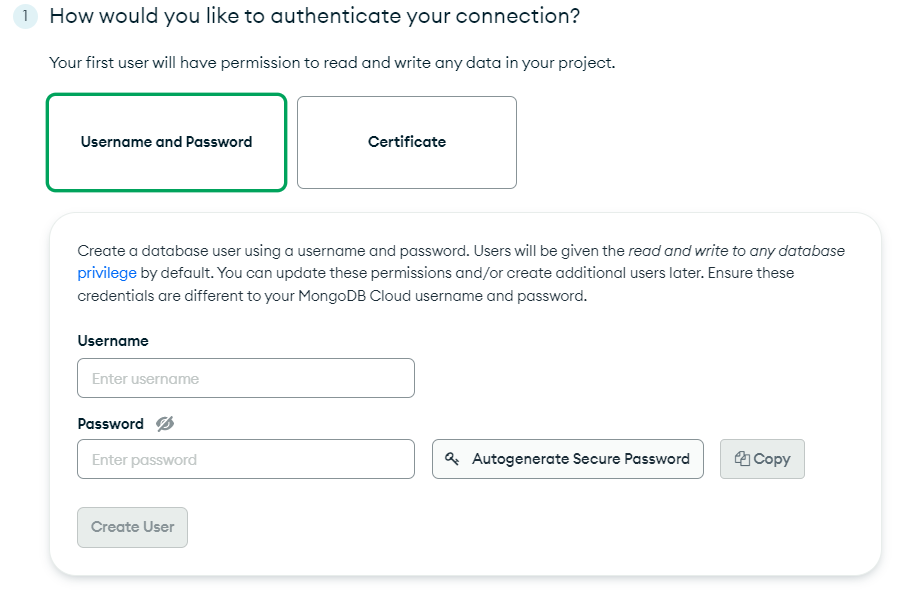</td>
    <td>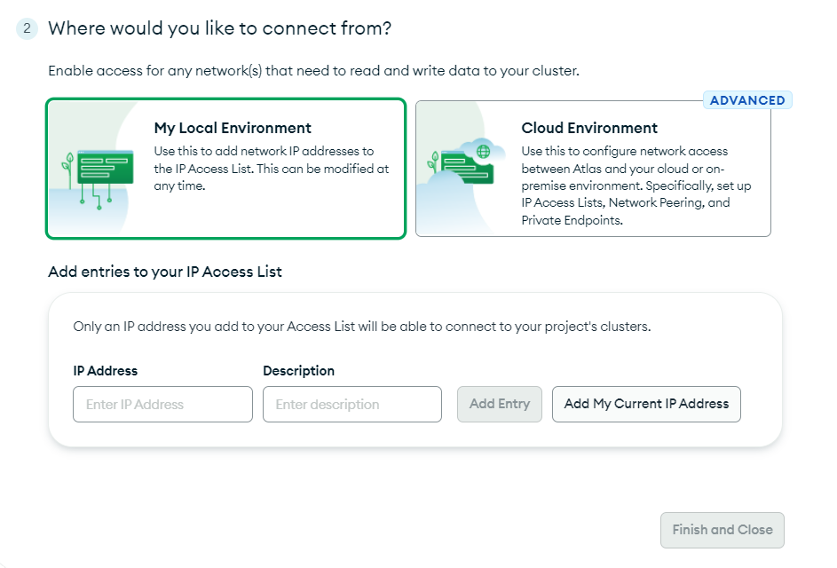</td>
  </tr>
  <tr>
</table>

 
6. Your account is ready, it will take a while to create a cluster. Finally, you will see following screen.  
    -> where you can add your teammate to collaborate.  
    -> create new database [with "browse collections" button] (see further instructions)  
    -> create an app in "App services" tab  
 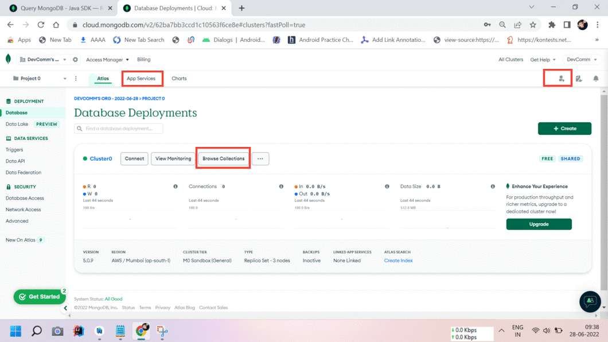
 
  
 7. Go to "Browse Collections", will get following page
 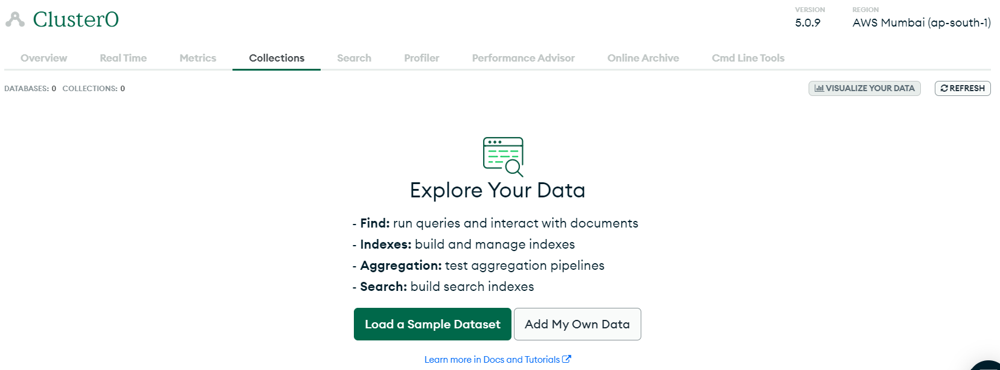
 
 8. Go to "Add My own Data" option, which will ask you database name and collection name, fill that and create a collection
 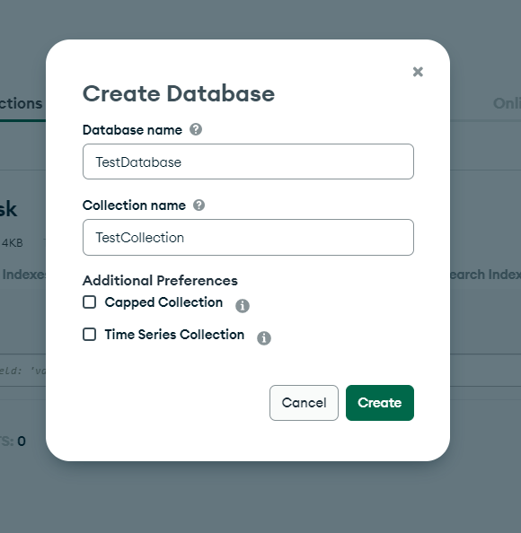
 
 9. Now go to the "App services" tab, select "build your own app"
 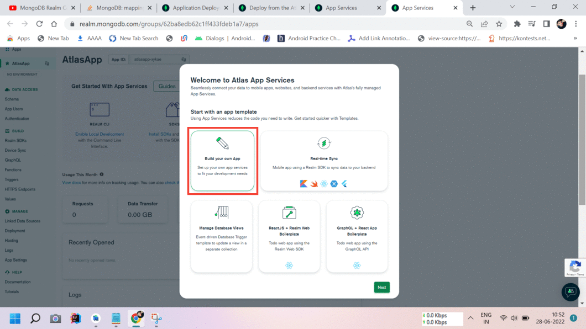 
 
 10. Continue with default settings
  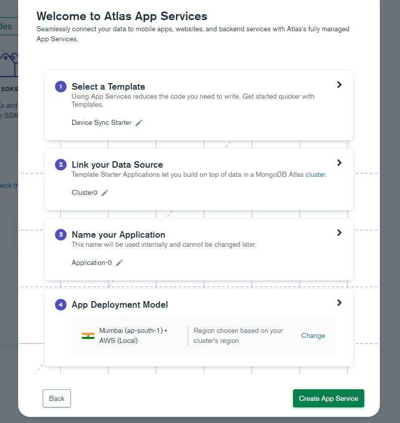
  
 11. App is created, you can see this page  
 Now you have to add rule for data access and user authentication method
 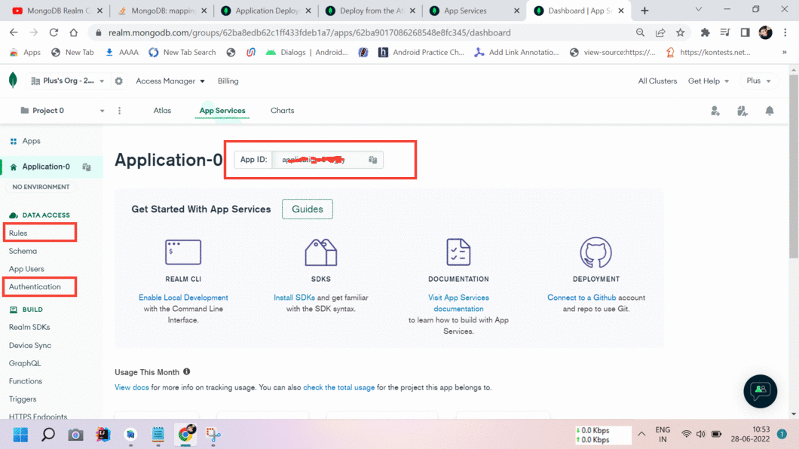
 
 12. Go to "rule", Yo can add customized rule for your data, for testing purpose, i'm giving access to everyone to read and write
  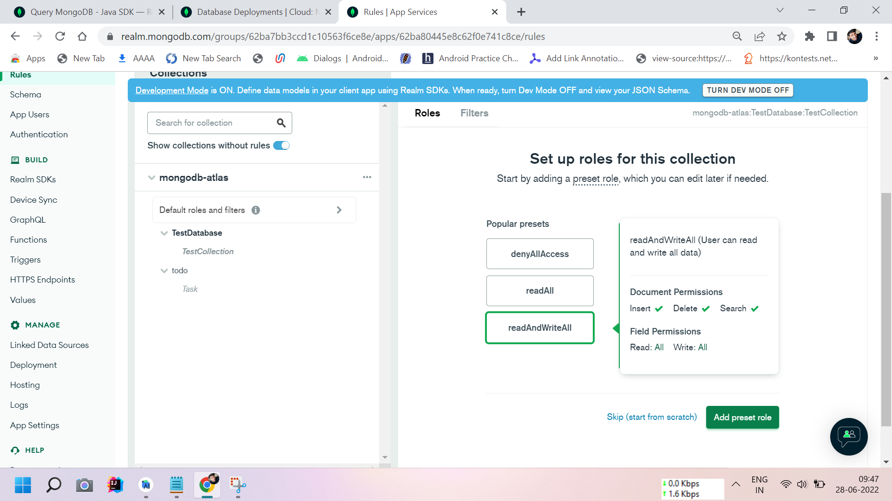
 
  
 13. Save your changes, Note that, saving and deploying is different thing so make sure you deploy your changes as shown below
  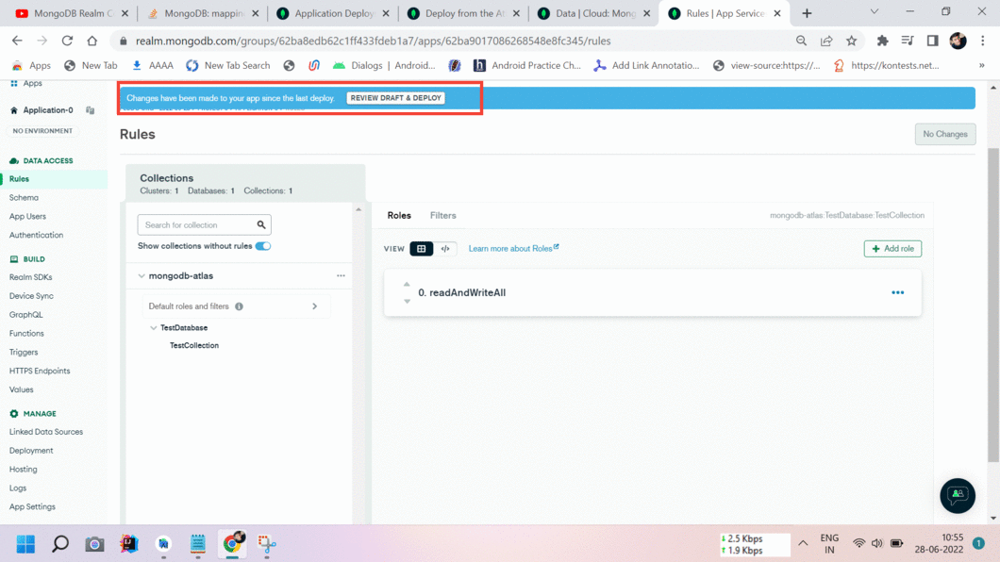
  
  14. Now go to "Authentication", turn on the way you want to authenticate your users, for now i'm using "anonymous login"  
  then save and deploy..
  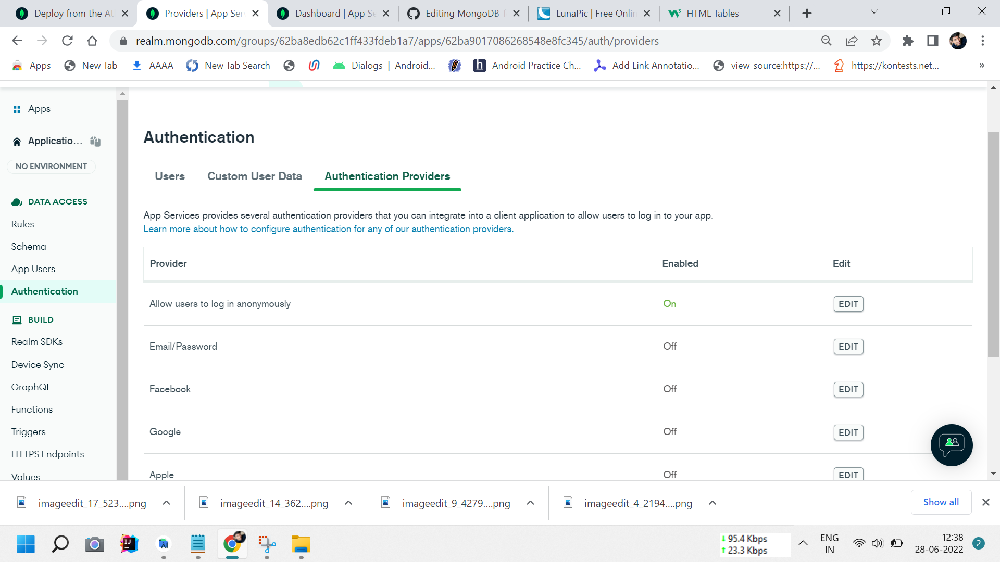
  
 
 

